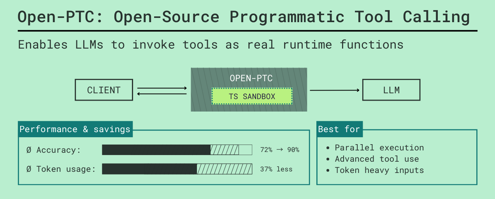

# Open-PTC



Most LLM agents struggle to scale when given access to dozens of tools. Sending huge tool schemas in every prompt burns context window tokens, and executing multi-step logic requires expensive, high-latency loops between the model and your application.

**Open-PTC** is a proxy and sandboxed runtime that solves this by enabling Programmatic Tool Calling. 

Instead of stuffing every tool schema into the LLM's prompt, Open-PTC connects to your Model Context Protocol (MCP) servers and local functions, and exposes them all to the LLM via a single `code_executor` tool. The LLM writes a TypeScript snippet to orchestrate the tools, and Open-PTC executes that code securely in an isolated Deno sandbox.

This structure allows models to execute complex, multi-step tool logic (loops, conditionals, data reshaping) in a single backend generation step, preventing the context window exhaustion and latency spikes typical of naive tool-calling loops.

## Why Open-PTC

Anthropic's research on [advanced tool use](https://www.anthropic.com/news/evaluating-advanced-tool-use) highlights the exact bottlenecks Open-PTC targets.

- Tool definition bloat is real: Anthropic reports examples where just loading tool definitions can consume 55K to 134K tokens before useful work starts.
- Search-based tool loading helps: they report reducing a 77K-token baseline to about 8.7K for comparable setups, preserving about 95% of context and reducing token usage by about 85%.
- Programmatic tool orchestration helps: they report average token usage dropping from 43,588 to 27,297 (about 37%) on complex research tasks.
- Accuracy can improve with better tool-use patterns: they report gains from tool search, programmatic calls, and examples-based guidance.

Open-PTC applies these ideas in an open runtime:

- Offload deterministic workflow logic (loops, branching, data shaping) into sandboxed TypeScript execution.
- Consolidate multiple tool schemas into a single `code_executor` tool, saving massive amounts of context window space.
- Give the model access to hundreds of tools through a unified, programmatic interface instead of stuffing every schema into the prompt.

Source style reference: Anthropic Engineering blog, "Introducing advanced tool use on the Claude Developer Platform".

## How It Works

Open-PTC runs up to four services simultaneously from a unified entrypoint (`src/server.ts`). Each service plays a specific role in the ecosystem:

- **API server (9730)**: Provides HTTP endpoints to list available tools and manually trigger code sandboxes.
- **MCP server (9731)**: Allows standard MCP clients (like Claude Desktop) to connect to the runtime.
- **WebSocket server (9733)**: Maintains bidirectional connections so the sandbox can trigger local functions residing in your application (Node, Python, etc.).
- **Proxy server (9734)**: Emulates the OpenAI API, allowing you to drop Open-PTC into existing LLM apps while transparently intercepting tool calls for sandbox execution.

High-level runtime flow depending on the integration mode:

**1. API / MCP Mode**
The client interacts with Open-PTC to discover tools and submit a TypeScript snippet. Open-PTC executes the code in a restricted Deno subprocess, directly invoking external MCP tools, and returns the final result to the client.

**2. WebSocket Mode (Local Tool Callbacks)**
Similar to the API mode, but the executing code can also call tools registered by the client. When a local tool is invoked, execution pauses, Open-PTC emits a `function_call` via WebSocket to your app, your app processes it and returns `function_call_output`, and the sandbox resumes (see `examples/ai-sdk/example.ts` and `examples/langgraph/example.py` for reference).

**3. Proxy Mode (OpenAI-compatible Orchestration)**
Your LLM app sends a standard chat completion request to Open-PTC's proxy. Open-PTC automatically injects a `code_executor` tool into the request. If the LLM uses the `code_executor`, Open-PTC intercepts it, runs the sandbox, handles all the tooling (including local function callbacks as normal tool calls), and eventually returns the final LLM response back to your client as if it successfully handled it all in one go.

## Integration Modes

### Group 1: API / MCP (Simple tool discovery and calling)

**REST API mode**
- Port: 9730
- Endpoints: /tree, /signatures, /exec
- Use when: you want simple HTTP introspection and manual sandbox execution
- Local tools: no

**MCP mode**
- Port: 9731
- Exposes MCP tools:
	- get_tools_tree
	- get_tool_signatures
	- execute_typescript_code
- Use when: you want to connect through standard MCP clients directly
- Local tools: no

### Group 2: WebSocket (Local tool callbacks)

**WebSocket mode**
- Port: 9733
- Client registers tools with register_tools
- Sandbox calls those tools via tool_call and receives tool_result
- Use when: your app owns local functions (Node, Python, etc.) and wants them exposed to sandbox execution
- Local tools: yes, namespace-isolated per WebSocket connection

### Group 3: Proxy (OpenAI-compatible orchestration)

**Proxy mode**
- Port: 9734
- Endpoint: POST /v1/responses
- Runtime tools are marked with: "open-ptc-runtime-function": true
- Proxy injects synthetic code_executor with generated signatures
- Use when: you want drop-in OpenAI-compatible client behavior plus transparent sandbox orchestration for any tool calls
- Local tools: yes, treated as normal tools (from the client's perspective) callable from the sandbox

Important:

- Open-PTC currently orchestrates runtime tools through /v1/responses through a LiteLLM endpoint by default, for easy integration.

## Run Open-PTC

### Option A: run directly with Deno

Start everything:

```bash
deno run --allow-all src/server.ts
```

Start selected services:

```bash
deno run --allow-all src/server.ts --api --mcp --ws --proxy
deno run --allow-all src/server.ts --proxy
deno run --allow-all src/server.ts --api --mcp
```

### Option B: Docker Compose (with proxy + LiteLLM)

```bash
docker compose up -d
```

This starts:

- Open-PTC (9730, 9731, 9733, 9734)
- LiteLLM (host 4001 -> container 4000)

RPC 9732 remains internal and is not exposed.

### Option C: Docker Compose without proxy

```bash
docker compose -f docker-compose.no-proxy.yml up -d
```

This starts API + MCP + WebSocket, and skips having to run LiteLLM.

### Quick verification

```bash
curl http://localhost:9730/tree
```

## MCP Configuration

Primary file:

- mcp_config.json

Reference example with env placeholders and output_schema overrides:

- mcp_config_example.json

### Supported transports

- http
- sse
- stdio

### Environment variable substitution

Any string value can use ${VAR_NAME}. Open-PTC resolves these from the process environment when loading config.

### Tool-level output schemas

Within each server config, tools can define output_schema.

Why this matters:

- output_schema improves generated TypeScript signatures
- better signatures improve the code_executor API surface for the model

**Note on missing `output_schema`**:
Most standard MCP tools do not currently provide an `output_schema`. You can ask the LLM to generate them for you while connected to the Open-PTC MCP, by using the prompt provided in `add_output_schema_prompt.md`.


### Signature generation

Signatures are auto-generated TypeScript interface definitions derived from a tool's JSON Schema. They form the API surface that the LLM references when writing TypeScript code for the sandbox. Reliable signatures mean fewer hallucinated arguments and higher execution success rates.

Signatures are grouped by namespace:

- MCP tools are grouped by cleaned server name
- WebSocket/local tools are grouped under main (or connection-prefixed internally)

API access:

- GET /signatures
- Optional filters: serverNames, toolNames

## Proxy and LiteLLM

Proxy mode depends on LiteLLM for model routing.

- Open-PTC forwards requests to LiteLLM /v1/responses
- LiteLLM model mapping is defined in litellm_config.yaml

### Runtime tool marker

In proxy requests, tools marked with:

- "open-ptc-runtime-function": true

are treated as runtime functions callable by sandbox code. Other tools are passed through as normal LLM tools.

### Runtime tool typing

Proxy-specific tool field:

- output_schema

This is optional but recommended, because it improves generated function signatures for code_executor.

## Example Clients

All examples assume Open-PTC is already running in the required mode.

### API client (MCP tools only, no local tools)

```bash
deno run --allow-all examples/api-client.ts
```

### MCP client (MCP tools only, no local tools)

```bash
deno run --allow-all examples/mcp-client.ts
```

### WebSocket clients (local tool callbacks)

Simple WebSocket client that registers a local tool and receives function_call events when the sandbox invokes it:
```bash
deno run --allow-all examples/ws-client.ts
```
For a more complex example of using WebSocket tools as part of an agentic loop, see the AI SDK and LangGraph examples below:

#### AI SDK example (local tools)
```bash
cd examples/ai-sdk
npm install
tsx example.ts
```
#### LangGraph example (local tools)
```bash
cd examples/langgraph
pip install -r requirements.txt
python example.py
```

### Proxy client (fetch)

```bash
deno run --allow-net --allow-env examples/proxy/proxy-client.ts
```

### Proxy client (OpenAI SDK)

```bash
deno run --allow-net --allow-env examples/proxy/proxy-sdk-client.ts
```

## Security and Resource Model

Current behavior:

- Sandbox is a separate Deno isolate per execution
- Restricted permissions by default:
	- network only to localhost:RPC_PORT for tool calls
	- env access only for RPC_SERVER_URL
- Execution timeout enforced (default 30s)
- WebSocket tool-call timeout is 60s
- Proxy chain depth limit is 10 (this prevents infinite loops by capping the maximum number of consecutive backend LLM requests made during a single orchestrated proxy session)
- Session store cleanup defaults to 5 minutes

Important caveat:

- The system supports concurrent access today, but the current threat model should not be treated as hardened multi-tenant isolation.

## Future Improvements

Planned/high-value next steps:

1. Implement Chat Completions API orchestration alongside existing Responses API orchestration for the Open-PTC proxy.
2. Secure multi-tenant support with a stronger threat model (beyond concurrent-access support).
3. Authentication and authorization for production deployments.
4. More resource control per connection/session (memory, CPU, quotas, policy controls).

## Code Map

- src/server.ts: unified startup and mode flags
- src/mcp/mcp-registry.ts: MCP discovery, grouping, signature retrieval
- src/codegen/signature-generator.ts: JSON schema to TypeScript signatures
- src/bridge/tool-bridge.ts: MCP, WebSocket, and proxy API routing
- src/execution/sandbox-executor.ts: sandbox process lifecycle
- src/servers/ws-server.ts: WebSocket protocol server
- src/proxy/proxy.ts: proxy request routing
- src/proxy/sandbox-orchestrator.ts: proxy session/chaining orchestration
- src/proxy/repl-tool-builder.ts: code_executor construction with signatures


## License
